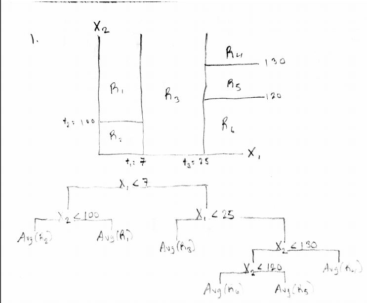
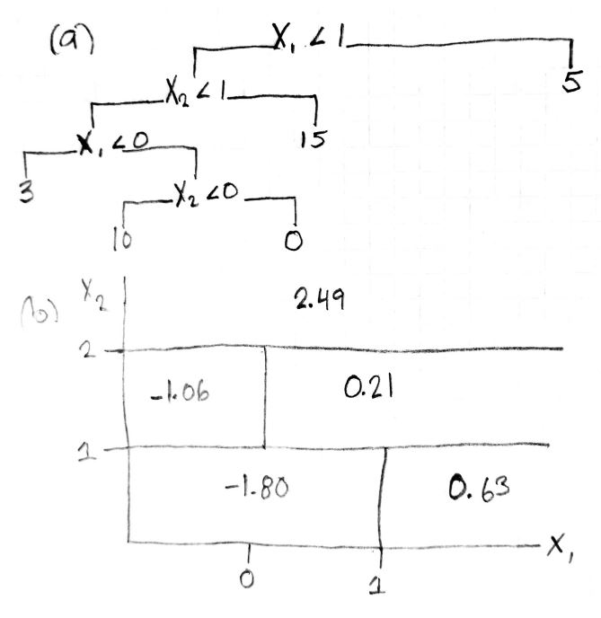

```{r echo = FALSE}
knitr::opts_chunk$set(fig.width=8, fig.height=5) 
```

### 1. Draw an example (of your own invention) of a partition of twodimensional feature space that could result from recursive binary splitting. Your example should contain at least six regions. Draw a decision tree corresponding to this partition. Be sure to label all aspects of your figures, including the regions $R_1,R_2, . . .$, the cutpoints $t_1, t_2, . . .$, and so forth.

```{r echo=FALSE, out.width = '100%'}

```

### 2. It is mentioned in Section 8.2.3 that boosting using depth-one trees (or stumps) leads to an additive model: that is, a model of the form $$f(X) = \Sigma_{j=1}^p f_j(X_j)$$. Explain why this is the case. You can begin with (8.12) in Algorithm 8.2.

Given $d = 1$, each $f_j(X_j)$ is an indicator or set of indicator functions of the form 
$$
f_j(X_j) = I(X_j <= c_i) = 
\begin{cases}
X_j <= c \; , y= A_m,\\
X_j > c \; , y= A_n
\end{cases}
$$

, where $c$ is the cutpoint for the stump and $A$ is the average value or dominant class at the terminal node.  If we have $B$ trees then each predictor $j$ maybe has more than one indicator function. For instance if the model has three splits for predictor $j$ then the additive model might look like,

$$f_j(X_j) = \beta_{j1} (I(X_j <= c_1) + \beta_{j2}  I(X_j <= c_2) + \beta_{j3} I(X_j <= c_3))$$

If we constrain $\lambda = B_{j1} = B_{j2} = ...=B_{jn}$ then we have,

$$f(x) = ...+ \lambda  (I(X_j <= c_1) + I(X_j <= c_2) + I(X_j <= c_3)) + ...$$

$$f(X) = \lambda  \Sigma_{j=1}^p\Sigma_{i=1}^c  I(X_j <= c_i)$$

Using the boosting tree algorithm we know that,

$$
\begin{aligned}
\hat{f}(x) &= 0\text{ and } r_i = y_i\; \forall i\\
\hat{f^1}(x) &= fit(X,r_i) \\
r_i &= y_i - \lambda \hat{f^1}(x)\\
\hat{f}(x) &= \hat{f}(x) + \lambda \hat{f^1}(x)\\
\hat{f}(x) &= \lambda \hat{f^1}(x) + \lambda \hat{f^2}(x) + ... + \lambda \hat{f^B}(x)\\
\hat{f}(x) &= \Sigma_{i=1}^B \lambda \hat{f^i}(x)
\end{aligned}
$$

The we can conclude, 

$$
\begin{aligned}
f(x) &= \Sigma_{i=1}^B \lambda f^i(x)\; \text{(Boosted algorithm)}\\
f(x) &= \Sigma_{j=1}^p\Sigma_{i=1}^c  I(X_j <= c_i)\\
\Sigma_{i\in j}^B\lambda f^i(x_j) &= f_j(x_j)\\
f(x) &= \Sigma_{j=1}^p f_j(x_j) \; \text{(Additive model)}
\end{aligned}
$$

### 3. Consider the Gini index, classification error, and cross-entropy in a simple classification setting with two classes. Create a single plot that displays each of these quantities as a function of $\hat{p_m1}$. The x-axis should display $\hat{p_m1}$, ranging from 0 to 1, and the y-axis should display the value of the Gini index, classification error, and entropy.

```{r}
p.m1 = seq(0,1, by = 0.01)
p.m2 = 1 - p.m1

gini = function(p.m1, p.m2){2*p.m1*p.m2}
class.error = function(p.m1, p.m2){1 - pmax(p.m1, p.m2) }
cross.entropy = function(p.m1, p.m2){-1*(p.m1*log(p.m1) +p.m2*log(p.m2))}

y.gini = gini(p.m1,p.m2)
y.class.error = class.error(p.m1, p.m2)
y.cross.entropy = cross.entropy(p.m1,p.m2)

plot(p.m1,y.gini, type = "l", col = "green",
     ylim = c(0,0.8),
     ylab = "",
     xlab = expression(hat(p)[m1]))
lines(p.m1,y.class.error, type = "l", col = "blue")
lines(p.m1,y.cross.entropy, type = "l", col = "red")
legend("topleft", legend = (c("Gini index",
                           "Class error",
                           "Cross-entropy")),
       col = c("green", "blue", "red"),
       lty = 1,
       cex = 1)
```

### 4. This question relates to the plots in Figure 8.12.

#### (a) Sketch the tree corresponding to the partition of the predictor space illustrated in the left-hand panel of Figure 8.12. The numbers inside the boxes indicate the mean of Y within each region.

#### (b) Create a diagram similar to the left-hand panel of Figure 8.12, using the tree illustrated in the right-hand panel of the same figure. You should divide up the predictor space into the correct regions, and indicate the mean for each region.

```{r echo=FALSE, out.width = '100%'}

```

### 5. Suppose we produce ten bootstrapped samples from a data set containing red and green classes. We then apply a classification tree to each bootstrapped sample and, for a specific value of X, produce 10 estimates of P(Class is Red|X): 0.1, 0.15, 0.2, 0.2, 0.55, 0.6, 0.6, 0.65, 0.7, and 0.75. There are two common ways to combine these results together into a single class prediction. One is the majority vote approach discussed in this chapter. The second approach is to classify based on the average probability. In this example, what is the final classification under each of these two approaches?

Using majority vote we arrive at 6 to 4 votes in favor of the red class. Using the average probability we get a probability of 0.45 and thus predict the green class.

### 6. Provide a detailed explanation of the algorithm that is used to fit a regression tree.

Consider a data set with $J$ predictors $X_{ij}$, continuous response variable $Y_i$, and some stopping criteria.

1) For each $j$ predictor find $R_1(j,s) = \{X | X_j < s\}$ and $R_2(j,s) = \{X | X_j < s\}$ such that we find the greatest minimization of the resdiual sum of squares $\Sigma_{i: x_i \in R_1(j,s)} (y_i - \hat{y_{R1}})^2 + \Sigma_{i: x_i \in R_2(j,s)} (y_i - \hat{y_{R2}})^2$

2) Find $R_{n}$ and $R_{n+1}$ by repeating the same optimized search in both $R_{n-2}$ and $R_{n-1}$.

3) Stop when the stopping criteria is reached.

### 7. In the lab, we applied random forests to the Boston data using mtry=6 and using ntree=25 and ntree=500. Create a plot displaying the test error resulting from random forests on this data set for a more comprehensive range of values for mtry and ntree. You can model your plot after Figure 8.10. Describe the results obtained.

```{r warning=FALSE, message=FALSE}
library(MASS)
library(randomForest)

#create test set
set.seed(17)
train = sample(1:nrow(Boston), 
               size = nrow(Boston)*.80,
               replace = FALSE)
boston.train = Boston[train,]
boston.test = Boston[-train,]
y.true = boston.test$medv

#RMSE
RMSE = function(y.true, y.pred){sqrt(mean((y.true - y.pred)^2))}

#random forest
p = seq(4,ncol(Boston), by = 2)
n.tree = seq(1,501, by = 20)
boston.RMSE = matrix(NA, ncol = length(n.tree), nrow = length(p))
for(i in 1:length(p)){
  for(n in 1:length(n.tree)){
    rf.boston = randomForest(medv ~.,
                         data = boston.train,
                         mtry = p[i],
                         ntree = n)
    y.pred = predict(rf.boston, 
                     newdata = boston.test)
    boston.RMSE[i,n] = RMSE(y.true,y.pred)
  }
}
```

```{r}
#plot RMSE against n.tree with different lines for p
plot(n.tree , boston.RMSE[1,], col = 1, type ="l", lwd = 2,
     ylab = "RMSE",
     xlab = "N trees",
     ylim = range(boston.RMSE),
     main = "Boston Housing Random Forest Test Error")
for(i in 2:length(p)){
  lines(n.tree , boston.RMSE[i,], col = i, type ="l", lwd = 2)
}
legend("topright", 
       legend = sapply("p =", paste, p ),
       col = 1:length(p),
       lty = 1,
       cex = 0.8)
```

At 100 trees the test error random forest model begins to stabilize between approximately \$4,500 and \$3,200. The performance of the $p=10$, $p=12$ and $p=14$ models appear consistently better than the lower $p$ models. The random forest model specified $p = 12,\; mtry = 421$ had the lowest RMSE (\$3,153).

### 8. In the lab, a classification tree was applied to the Carseats data set after converting Sales into a qualitative response variable. Now we will seek to predict Sales using regression trees and related approaches, treating the response as a quantitative variable.

#### (a) Split the data set into a training set and a test set.
```{r}
library(ISLR)
set.seed(777)
train = sample(1:nrow(Carseats),
               size = nrow(Carseats)*.80,
               replace = FALSE)
carseats.train = Carseats[train,]
carseats.test = Carseats[-train,]
```

### (b) Fit a regression tree to the training set. Plot the tree, and interpret the results. What test MSE do you obtain?

```{r}
library(tree)
rt.carseats = tree(Sales ~ .,
                   data = carseats.train,
                   split = "deviance")
summary(rt.carseats)
plot(rt.carseats)
text(rt.carseats, pretty=0)
y.true = carseats.test$Sales
y.pred = predict(rt.carseats, newdata = carseats.test)
RMSE(y.true, y.pred)
RMSE(y.true, y.pred)^2
```

The regression tree includes 7 predictors and 19 terminal nodes. Shelving location and price are higher nodes in the tree and thus probably explain key variation in carseat sales. The model has a test RMSE of 2.16 and a test MSE of 4.67.

### (c) Use cross-validation in order to determine the optimal level of tree complexity. Does pruning the tree improve the test MSE?

```{r}
set.seed(945)
#cross-validation to find optimal cost-complexity and tree size
cv.rt.carseats = cv.tree(rt.carseats,
                         K = 10)
par(mfrow=c(1,2))
plot(cv.rt.carseats$k, cv.rt.carseats$dev,
     type = "l", col = "green",
     main = "Deviance as Function of Cost-Complexity")
plot(cv.rt.carseats$size, cv.rt.carseats$dev,
     type = "l", col = "orange",
     main = "Deviance as Function of Tree Size")

#tree pruning
prune.rt.carseats = prune.tree(rt.carseats, 
                          best = cv.rt.carseats$size[which.min(cv.rt.carseats$dev)])
y.pred = predict(prune.rt.carseats, newdata = carseats.test)
RMSE(y.true, y.pred)
RMSE(y.true, y.pred)^2
```

The pruned tree test RMSE and MSE is 2.28 and 5.21, respectively. Pruning did not improve the test MSE.

#### (d) Use the bagging approach in order to analyze this data. What test MSE do you obtain? Use the importance() function to determine which variables are most important.

```{r}
#bagged tree
set.seed(9081)
bag.carseats = randomForest(Sales ~ .,
                            data = carseats.train,
                            n.tree = 500,
                            mtry = ncol(Carseats) - 1,
                            importance = TRUE
                            )
#reduction in node impurity (Gini index) and % reduction in OOB MSE with predictor
importance(bag.carseats)

#test RMSE and MSE
y.pred = predict(bag.carseats,
                 newdata = carseats.test)
RMSE(y.true, y.pred)
RMSE(y.true, y.pred)^2
```

Using a bagged regresstion tree with 500 trees we obtain a test RMSE and MSE of 1.65 and 2.72 respectively. This is better than the regression tree and pruned tree approach. The most important predictors by reduction in node impurity and out-of-bag MSE were shelving location, prce, local advertising budget, and competitor pricing.

### (e) Use random forests to analyze this data. What test MSE do you obtain? Use the importance() function to determine which variables are most important. Describe the effect of m, the number of variables considered at each split, on the error rate obtained.

```{r}
#random forest
set.seed(104)
m = seq(2,10, by = 1)
rmse = rep(NA, 9)
for (i in 1:9){
  rf.carseats = randomForest(Sales ~ .,
                            data = carseats.train,
                            n.tree = 500,
                            mtry = m[i]  ,
                            importance = TRUE
                            )
  y.pred = predict(rf.carseats,
                    newdata = carseats.test)
  rmse[i] = RMSE(y.true, y.pred)
}

#plot MSE and RMSE against m
par(mfrow = c(1,2))
plot(m, rmse^2, type = "b", col = "red",
     main = "MSE as Function of RF Mtry")
plot(m, rmse, type = "b", col = "red",
     main = "RMSE as Function of RF Mtry")
rmse[5]
#retain m = 6 model
rf.carseats = randomForest(Sales ~ .,
                            data = carseats.train,
                            n.tree = 500,
                            mtry = 6  ,
                            importance = TRUE
                            )

#reduction in node impurity (Gini index) and % reduction in OOB MSE with predictor
importance(rf.carseats)
```

Using a random forest with m from 2 to 10, we obtain a sequence of test MSE and RMSE values. When m = 6 and 10 the model achieves MSE and RMSE near 2.64 and 1.63. While not significantly lower than the previous bagged model this is still an improvement. The most important predictors by reduction in node impurity and out-of-bag MSE were shelving location, prce, local advertising budget, and competitor pricing. This is no different than the bagged model. 

### 9. This problem involves the OJ data set which is part of the ISLR package.

####(a) Create a training set containing a random sample of 800 observations, and a test set containing the remaining observations.

```{r}
set.seed(308)
train = sample(1:nrow(OJ), size = 800, replace = FALSE)
oj.train = OJ[train,]
oj.test = OJ[-train,]
y.true = oj.test$Purchase
```

#### (b) Fit a tree to the training data, with Purchase as the response and the other variables as predictors. Use the summary() function to produce summary statistics about the tree, and describe the results obtained. What is the training error rate? How many terminal nodes does the tree have?

```{r}
#classification tree
tree.oj = tree(Purchase ~ .,
               data = oj.train,
               split = "deviance")
#summary
summary(tree.oj)
```

The training error rate is 16.8% . The tree has 7 terminal nodes.

#### (c) Type in the name of the tree object in order to get a detailed text output. Pick one of the terminal nodes, and interpret the information displayed.

```{r}
tree.oj
```

The seventh terminal node denotes customer brand loyalty for Citrus Hill, which is a continous measure bounded by 0 and 1. There were 268 cutomers in this splite. We see that if a customer's loyalty for Citrus Hill is above 0.76 ath this stage of the terminal then there is a 95 percent chance the customer bought Citrus Hill.

#### (d) Create a plot of the tree, and interpret the results.

```{r}
plot(tree.oj)
text(tree.oj, pretty=0)
```

We see that customer loyalty is at the higher nodes of the tree denoting its importance in partitioning the feature space. Price difference is the only other predictor used.

#### (e) Predict the response on the test data, and produce a confusion matrix comparing the test labels to the predicted test labels. What is the test error rate?

```{r}
#test error
y.pred = predict(tree.oj,
                 newdata = oj.test,
                 type ="class")
table1 = table(y.true,y.pred)
table1
1 - (table1[1,1] + table1[2,2])/sum(table1)
```

The test error rate is 17.4 percent.

#### (f) Apply the cv.tree() function to the training set in order to determine the optimal tree size.

```{r}
set.seed(403)
cv.tree.oj = cv.tree(tree.oj,
                     K = 10)
par(mfrow = c(1,2))
plot(cv.tree.oj$k, cv.tree.oj$dev,
     type = "b",
     col = "blue",
     main = "Deviance as Function of Cost-Complexity")
plot(cv.tree.oj$size, cv.tree.oj$dev,
     type = "b",
     col = "red",
     main = "Deviance as Function of Tree Size")
```

#### (g) Produce a plot with tree size on the x-axis and cross-validated classification error rate on the y-axis.

```{r}
set.seed(30)
cv.tree.oj = cv.tree(tree.oj,
                     K = 10,
                     FUN = prune.misclass
                     )
plot(cv.tree.oj$size, cv.tree.oj$dev/nrow(oj.train),
    ylab = "CV Missclassification",
    xlab = "Tree Size",
    main = "CV Missclassification as Function of Tree Size",
    type = "b",
    col = "green"
)
```

#### (h) Which tree size corresponds to the lowest cross-validated classification error rate?

The the trees of sizes 4 and 7 have the lowest missclassification rate.

#### (i) Produce a pruned tree corresponding to the optimal tree size obtained using cross-validation. If cross-validation does not lead to selection of a pruned tree, then create a pruned tree with five terminal nodes.

```{r}
pruned.tree.oj = prune.misclass(tree.oj, best = 4)
```

#### (j) Compare the training error rates between the pruned and unpruned trees. Which is higher?

```{r}
summary(pruned.tree.oj)
summary(tree.oj)
```

The pruned (4 terminal nodes) and unpruned (7 terminal nodes) tree have that same training missclassification rate 16.9 percent.

#### (k) Compare the test error rates between the pruned and unpruned trees. Which is higher?

```{r}
y.pred = predict(pruned.tree.oj,
                 newdata = oj.test,
                 type = "class")
table2 = table(y.true, y.pred)
table2
1 - (table2[1,1] + table2[2,2])/sum(table2)
```

The pruned (4 terminal nodes) and unpruned (7 terminal nodes) tree have that same test missclassification rate 17.4 percent.

### 10. We now use boosting to predict Salary in the Hitters data set.

#### (a) Remove the observations for whom the salary information is unknown, and then log-transform the salaries.

```{r}
hitters = Hitters[!is.na(Hitters$Salary),]
hitters$Salary = log(hitters$Salary)
```

#### (b) Create a training set consisting of the first 200 observations, and a test set consisting of the remaining observations.

```{r}
hitters.train = hitters[1:200,]
hitters.test = hitters[-seq(1,200,by=1),]
y.true = hitters.test$Salary
```

#### (c) Perform boosting on the training set with 1,000 trees for a range of values of the shrinkage parameter $\lambda$. Produce a plot with different shrinkage values on the x-axis and the corresponding training set MSE on the y-axis.

```{r}
#boosted tree
library(gbm)
set.seed(9074)
shrink = seq(0.001, 0.1, by = 0.001)
mse.train = rep(NA, 100)
mse.test = rep(NA, 100)
for(i in 1:100){
  boost.hitters = gbm(Salary ~., data = hitters.train,
                      distribution = "gaussian",
                      shrinkage = shrink[i],
                      bag.fraction = 1,
                      n.tree = 1000
  )
  y.pred.train = predict(boost.hitters,
                     newdata = hitters.train,
                     n.trees = 1000)
  y.pred.test = predict(boost.hitters,
                     newdata = hitters.test,
                     n.trees = 1000)
  mse.train[i] = RMSE(hitters.train$Salary,y.pred.train)^2
  mse.test[i] = RMSE(y.true,y.pred.test)^2
}
plot(shrink, mse.train, 
     type = "b",
     main = "Hitter Salary Training MSE",
     ylab = "Training Mean Squared Error",
     xlab = expression(lambda),
     col = "blue")
```

#### (d) Produce a plot with different shrinkage values on the x-axis and the corresponding test set MSE on the y-axis.

```{r}
plot(shrink, mse.test, 
     type = "b",
     main = "Hitter Salary Test MSE",
     ylab = "Test Mean Squared Error",
     xlab = expression(lambda),
     col = "red")
```

#### (e) Compare the test MSE of boosting to the test MSE that results from applying two of the regression approaches seen in Chapters 3 and 6.

```{r}
library(glmnet)
set.seed(33)
#multiple regression and lasso models
hitters.lm = lm(Salary~.,
                data = hitters.train)
X = model.matrix(Salary ~ ., data = hitters.train)
y = hitters.train[,"Salary"]
hitters.lasso = cv.glmnet(X,y,
                       family = "gaussian",
                       type.measure = "mse")
lamda.min = hitters.lasso$lambda.min
hitters.lasso = glmnet(X,y,
                       family = "gaussian",
                       lambda = lamda.min)
#predictions
y.pred.lm = predict(hitters.lm,
                    newdata = hitters.test)
y.pred.lasso = predict(hitters.lasso,
                    newx = model.matrix(Salary ~., data = hitters.test),
                    s = lamda.min)
mse.lm = RMSE(hitters.test$Salary, y.pred.lm)^2
mse.lasso = RMSE(hitters.test$Salary, y.pred.lasso)^2

#comparison
table3 = data.frame("GBM" = min(mse.test),
                    "Multiple Regression" = mse.lm,
                    "Lasso" = mse.lasso)
knitr::kable(round(table3,2), caption = "Comparison of Regression Models Test MSE")
```

We see that the boosted regression model has almost halved the test mean squared error, vastly outperforming both a multiple regression including all of the predictors and a lasso model.

### (f) Which variables appear to be the most important predictors in the boosted model?

```{r}
boost.hitters = gbm(Salary ~., data = hitters.train,
                    distribution = "gaussian",
                    shrinkage = shrink[which.min(mse.test)],
                    bag.fraction = 1,
                    n.tree = 1000
                    )
summary(boost.hitters)
```

Using the relative influence measure we observe that number of career at bats and number of career runs are the most important predictors for log-Salary.

#### (g) Now apply bagging to the training set. What is the test set MSE for this approach?

```{r}
#boosted and bagged regression
set.seed(102)
shrink = seq(0.001, 0.1, by = 0.001)
mse.bag.test = rep(NA, 100)
for(i in 1:100){
  boost.hitters = gbm(Salary ~., data = hitters.train,
                      distribution = "gaussian",
                      shrinkage = shrink[i],
                      bag.fraction = 0.3,
                      n.tree = 1000
  )
  y.pred.test = predict(boost.hitters,
                     newdata = hitters.test,
                     n.trees = 1000)
  mse.bag.test[i] = RMSE(y.true,y.pred.test)^2
}

#comparison
table4 = data.frame("Bag-GBM" = min(mse.bag.test),
                    "GBM" = min(mse.test),
                    "Multiple Regression" = mse.lm,
                    "Lasso" = mse.lasso)
knitr::kable(round(table4,3), caption = "Comparison of Regression Models Test MSE")
```

There is a small reduction in test MSE using a bagged and boost model compared to the boosted only model.

### 11. This question uses the Caravan data set.

#### (a) Create a training set consisting of the first 1,000 observations, and a test set consisting of the remaining observations.

```{r}
#training and test set
caravan.train = Caravan[1:1000,]
caravan.test = Caravan[-seq(1:1000),]
y.true = as.numeric(caravan.test$Purchase) - 1
```

#### (b) Fit a boosting model to the training set with Purchase as the response and the other variables as predictors. Use 1,000 trees, and a shrinkage value of 0.01. Which predictors appear to be the most important?

```{r}
boost.caravan = gbm(as.numeric(Purchase) - 1 ~ ., 
                    data = caravan.train,
                    distribution = "bernoulli",
                    bag.fraction = 1,
                    n.tree = 1000,
                    shrinkage = 0.01)
summary(boost.caravan)
```

Contribution car policies (PPERSAUT), purchasing power class (MKOOPKLA), and high level education (MOPLHOOG) are the predictors with the top three relative influence scores.

#### (c) Use the boosting model to predict the response on the test data. Predict that a person will make a purchase if the estimated probability of purchase is greater than 20 %. Form a confusion matrix. What fraction of the people predicted to make a purchase do in fact make one? How does this compare with the results obtained from applying KNN or logistic regression to this data set?

```{r warning=FALSE}
set.seed(107)
#boosted classifier
y.pred = predict(boost.caravan,
                 newdata = caravan.test,
                 n.trees = 1000,
                 type = "response")
y.pred[y.pred > .20] = 1
y.pred[y.pred <= .20] = 0
table5 = table(y.true, y.pred)
table5
(table5[2,2] )/(table5[2,1] + table5[2,2])

#knn
library(class)
#knn prediction
y.pred = knn(train = caravan.train[, !(colnames(caravan.train) == "Purchase")],
             test = caravan.test[, !(colnames(caravan.train) == "Purchase")],
             cl = as.numeric(caravan.train$Purchase) - 1,
             k=5)
table6 = table(y.true, y.pred)
table6
(table6[2,2] )/(table6[2,1] + table6[2,2])

#logisic regression
caravan.log = glm(Purchase ~.,
                  data = caravan.train,
                  family = binomial)
y.pred = predict(caravan.log, newdata = caravan.test, type = "response")
y.pred[y.pred > 0.2] = 1
y.pred[y.pred <= 0.2] = 0
table7 = table(y.true, y.pred)
table7
(table7[2,2] )/(table7[2,1] + table7[2,2])

```

The logistic regression model has the highest positive predictive value (0.20), followed by the boosted classifier (0.07), and then a k=5 KNN model (0.01).

### 12. Apply boosting, bagging, and random forests to a data set of your choice. Be sure to fit the models on a training set and to evaluate their performance on a test set. How accurate are the results compared to simple methods like linear or logistic regression? Which of these approaches yields the best performance?

```{r}
#train and test rmse
rmse.train = rep(NA, 4)
rmse.test = rep(NA, 4)  

###swiss dataset
train = sample(1:nrow(swiss),
               size = nrow(swiss)*.75,
               replace = FALSE)
swiss.train = swiss[train,]
swiss.test = swiss[-train,]

###linear regression
swiss.lm = lm(Fertility ~., 
              data= swiss.train)
y.pred.lm.train = predict(swiss.lm, 
                          newdata = swiss.train)
y.pred.lm.test = predict(swiss.lm, 
                         newdata = swiss.test)
rmse.train[1] = RMSE(y.pred.lm.train,swiss.train$Fertility) 
rmse.test[1] = RMSE(y.pred.lm.test,swiss.test$Fertility) 

###boosted model
set.seed(100)
swiss.gbm = gbm(Fertility ~.,
                data = swiss.train,
                n.trees = 1000,
                interaction.depth = 1,
                bag.fraction = 1,
                distribution = "gaussian",
                shrinkage = 0.01)
y.pred.gbm.train = predict(swiss.gbm,
                           n.trees = 1000,
                           newdata = swiss.train)
y.pred.gbm.test = predict(swiss.gbm,
                          n.trees = 1000,
                          newdata = swiss.test)
rmse.train[2] = RMSE(y.pred.gbm.train,swiss.train$Fertility) 
rmse.test[2] = RMSE(y.pred.gbm.test,swiss.test$Fertility) 

###bagged model
set.seed(506)
swiss.bag = randomForest(Fertility ~ .,
                            data = swiss.train,
                            n.tree = 500,
                            mtry = ncol(swiss) - 1,
                            importance = TRUE
                            )
y.pred.bag.train = predict(swiss.bag,
                           newdata = swiss.train)
y.pred.bag.test = predict(swiss.bag,
                          newdata = swiss.test)
rmse.train[3] = RMSE(y.pred.bag.train,swiss.train$Fertility) 
rmse.test[3] = RMSE(y.pred.bag.test,swiss.test$Fertility) 

###random forest
set.seed(17)
swiss.rf = randomForest(Fertility ~ .,
                            data = swiss.train,
                            n.tree = 500,
                            mtry = 3,
                            importance = TRUE
                            )
y.pred.rf.train = predict(swiss.rf,
                           newdata = swiss.train)
y.pred.rf.test = predict(swiss.rf,
                          newdata = swiss.test)
rmse.train[4] = RMSE(y.pred.rf.train ,swiss.train$Fertility) 
rmse.test[4] = RMSE(y.pred.rf.test,swiss.test$Fertility)

df = data.frame("Training RMSE" = rmse.train,
                "Test RMSE" = rmse.test)
rownames(df) = c("Linear",
                 "Boosted",
                 "Bagged",
                 "Random Forest")
knitr::kable(round(df,4))
```

The data selected is 47 French-speaking provinces of Switzerland (1888) with 5 socio-economic variables used to predict a standardized fertility measure. Linear, boosted, bagged, and random forest models were fit to the data. The table above shows that, while the linear model has the highest training root mean squared error (RMSE) it has the lowest test RMSE, compared to the more flexible tree models. This supports the use of a linear model for the data.